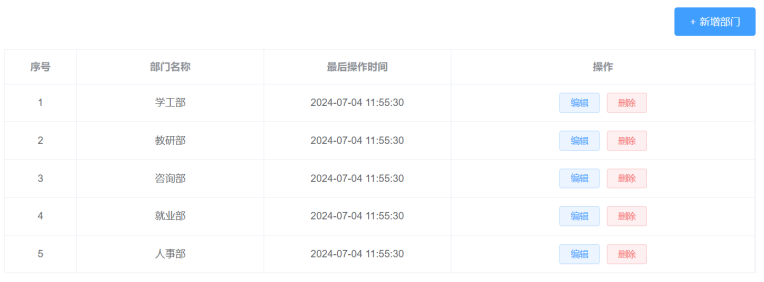
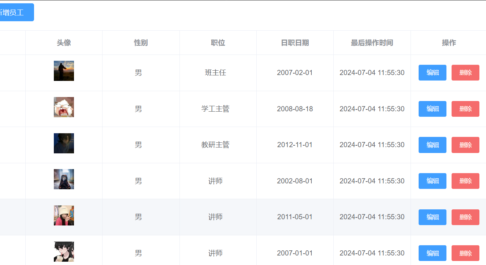
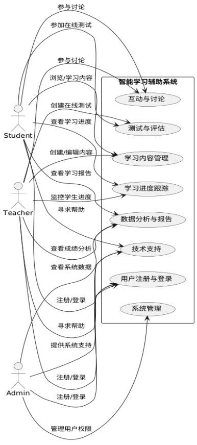
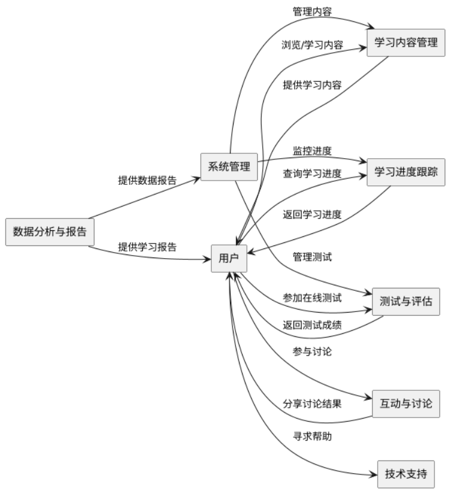
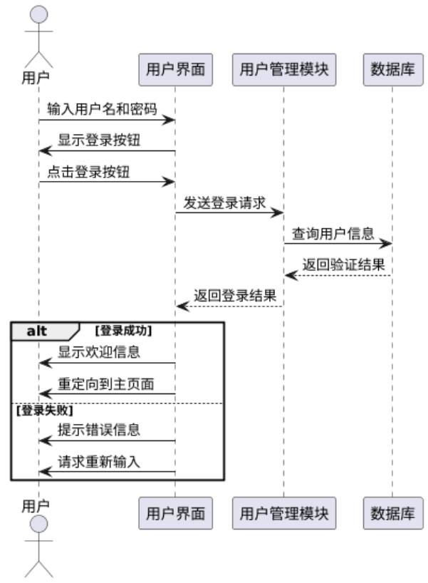
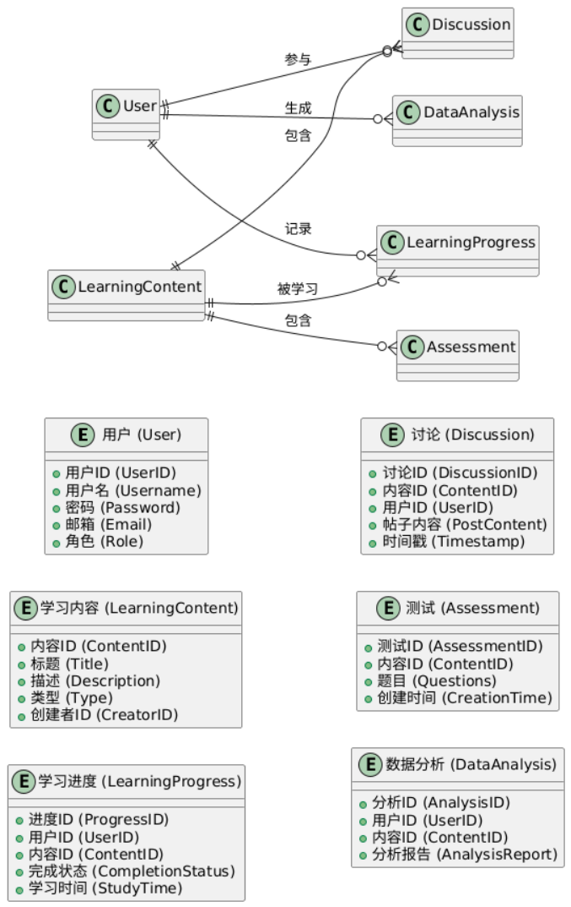

# 技术栈

- SpringBoot
- Mybatis
- 阿里云对象存储
- 分页插件PageHelper 
- JWT+Interceptor 登录认证
- AOP日志处理

# 快速启动

前端

- 前端源码不在此仓库
- 直接将Nginx目录放入一个纯英文目录下打开即可
- Nginx监听90端口，反向代理到localhost：8080

后端

- 默认8080端口
- IDEA+Maven+JDK11
- 数据库MySQL 建数据库 库名tlias 数据表在SQL文件中
- 阿里云密钥. 

# 项目部分页面展示
 

# 项目UML分析

## 用例图
 

## 数据流图
 

## 时序图
  

## ER图
 